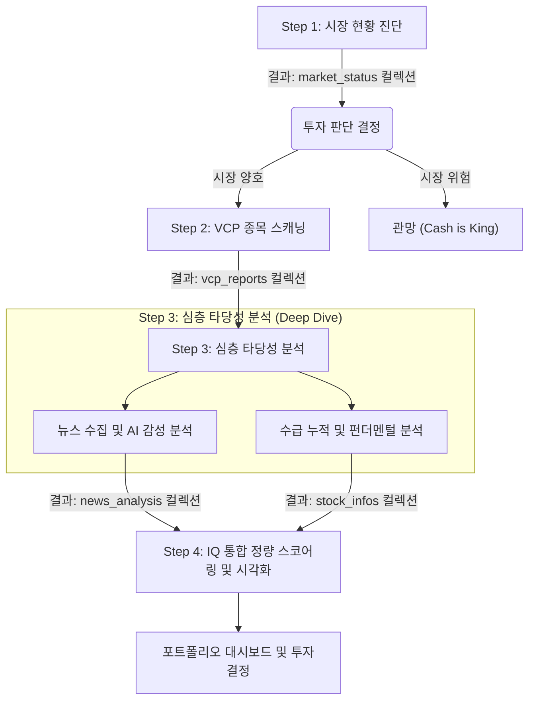
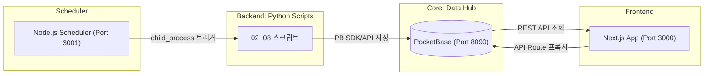

# 01. 아키텍처 및 데이터 흐름 (Architecture & Data Flow)

이 문서는 ClosingSHIN 프로젝트의 전반적인 데이터 파이프라인과 각 분석 구간을 통합하여 설명합니다. '시장 진단 -> 종목 발굴 -> 심층 분석 -> 투자 결정 및 포트폴리오 관리'로 이어지는 전체 프로세스를 다룹니다.

---

## 1. 기술 스택

| 계층 | 기술 |
|---|---|
| **Frontend** | Next.js 16 + React 19 + TypeScript + Tailwind CSS v4 |
| **State** | Zustand (서버 API 기반, persist 없음) |
| **Charts** | Recharts |
| **Database** | PocketBase (SQLite 기반, REST API + 파일 서빙) |
| **Backend Scripts** | Python 3 (venv), `pb_utils.py` 모듈로 PB SDK 연동 |
| **Scheduler** | Node.js `node-cron` 기반 (`backend/scheduler.ts`, Port 3001) |
| **Deploy** | Docker + Synology DS218+ NAS |

---

## 2. 전체 파이프라인 개요 (Pipeline Overview)

모든 데이터 처리는 **Top-Down (거시에서 미시로)** 방식으로 진행됩니다.

---

## 3. PocketBase 컬렉션 매핑

모든 데이터는 PocketBase 컬렉션에 저장됩니다. Python 스크립트가 `pb_utils.py`의 함수를 통해 데이터를 읽고 쓰며, 프론트엔드는 Next.js API Route를 통해 PocketBase에 접근합니다.

| 컬렉션명 | 용도 | 주요 필드 | 작성 스크립트 |
|---|---|---|---|
| `market_status` | 시장 현황 (지수, 환율, 수급) | `date`, `kospi`, `kosdaq`, `exchange_rate`, `investors` 등 | `05_collect_market_status.py` |
| `vcp_reports` | VCP 스캔 결과 | `date`, `ticker`, `name`, `vcp_score`, `jump_score`, `contractions` 등 | `02_scan_vcp.py` |
| `vcp_charts` | VCP 분석 차트 이미지 | `date`, `ticker`, `chart` (file) | `03_visualize_vcp.py` |
| `news_reports` | 수집된 뉴스 원문 | `date`, `ticker`, `title`, `description`, `link`, `source` | `04_collect_news.py` |
| `news_analysis` | AI 뉴스 감성 분석 결과 | `date`, `ticker`, `sentiment_score`, `impact`, `time_horizon` 등 | `05_analyze_news.py` |
| `stock_infos` | 수급/펀더멘털 데이터 | `date`, `ticker`, `per`, `pbr`, `supply_score`, `fundamental_score` 등 | `06_collect_stock_data.py` |
| `ohlcv` | 일봉 주가 데이터 | `code`, `date`, `open`, `high`, `low`, `close`, `volume` | `08_sync_market_data.py` |
| `portfolio` | 포트폴리오 보유 종목 | `ticker`, `name`, `buyPrice`, `quantity`, `simulation` 등 | 프론트엔드 API |
| `settings` | 시스템 설정/상태 | `key`, `value` (JSON) | 각종 스크립트 |
| `system_logs` | 시스템 로그 | `message`, `source`, `level` | `pb_utils.log_to_pb()` |

---

## 4. 주요 스크립트 및 데이터 흐름 상세

### Step 1: 시장 현황 진단 (Market Status)
한국 시장이 현재 투자하기 적합한(Risk-On) 상태인지 판단합니다.
- **스크립트:** `Scripts/05_collect_market_status.py`
- **수집 데이터:** 환율, 미 국채 수익률, 코스피/코스닥 지수 흐름, 투자자별 매매 동향 등
- **저장:** PocketBase `market_status` 컬렉션 + `settings` 컬렉션(최신 시황 미러링)

### Step 2: 후보 종목 발굴 (VCP Scanning)
기술적으로 에너지가 응축된 종목을 스캔합니다.
- **스크립트:** `Scripts/02_scan_vcp.py`
- **로직:** 최근 50일 추세 상승, 변동성 축소(Contraction) 패턴 2회 이상 발생, 최근 거래량 급감(Volume Dry-up) 확인
- **저장:** PocketBase `vcp_reports` 컬렉션, `vcp_charts` 컬렉션

### Step 3: 심층 타당성 분석 (Deep Validations)
발굴된 VCP 종목의 질적, 수급적 타당성을 검증합니다.

1. **뉴스 수집 및 AI 분석** (`Scripts/04_collect_news.py`, `Scripts/05_analyze_news.py`)
   - Naver API로 뉴스를 수집한 뒤 Gemini API를 활용하여 뉴스의 호재/악재, 지속성, 매매 신호를 분석합니다.
   - **저장:** PocketBase `news_reports`, `news_analysis` 컬렉션

2. **수급 및 펀더멘털 점검** (`Scripts/06_collect_stock_data.py`)
   - 주단위~월단위 기관/외국인 누적 순매수 금액 및 PER/PBR 데이터를 수집합니다.
   - **저장:** PocketBase `stock_infos` 컬렉션

### Step 4: 시각화 및 자동화 (Visualization & Automation)
- **차트 생성:** `Scripts/03_visualize_vcp.py` (캔들 차트 및 MA 50/150/200 렌더링)
- **과거 데이터/벌크 수집:** `Scripts/generate_historical_data.py`를 활용해 위 스크립트들을 특정 날짜 범위에 대해 일괄 실행 가능

---

## 5. IQ (Integrated Quant) 통합 모델 스코어링 로직

단순한 VCP 패턴 발견을 넘어, 여러 평가 요소를 통합하여 **"Total Decision Score (0~100점)"**를 산출하고 의사결정을 돕습니다.

| 분석 요소 | 가중치 | 데이터 소스 | 설명 |
|---|---|---|---|
| **VCP Technical** | **20%** | `vcp_reports` | 상승 추세 지속 및 파동 수축 정도. 패턴의 완성도 |
| **Supply (Flow)** | **30%** | `stock_infos` | 외인/기관 연속 순매수 동향. 자금 유입 여부 |
| **AI Sentiment** | **30%** | `news_analysis` | 뉴스 기반 호조/악재 점수 (-1~1 -> 0~100 스케일 변환) |
| **Fundamentals** | **10%** | `stock_infos` | 저PER/저PBR, 퀄리티 지표. 최소한의 안정성 확보 |
| **Sector/RS** | **10%** | `stock_infos` | 시장 대비 상대 강도 |

**점수별 액션 플랜 등급 (Health Badge):**
- **80점 이상 (STRONG_BUY):** 자금 유입 및 명확한 재료가 동반된 특A급 셋업 (적극 매수)
- **60~79점 (WATCHLIST):** 패턴은 완성되었으나 수급/재료 확인이 대기 중 (관심종목 유지)
- **40~59점 (NEUTRAL):** 추가적인 조정 및 분석 필요
- **39점 이하 (WEAK):** 매수 금지

**적용 위치:** `frontend/src/lib/scoreCalculator.ts` 를 통해 통합 스코어가 계산되며 대시보드에 시각화됩니다.

---

## 6. 데이터 흐름 시각화

