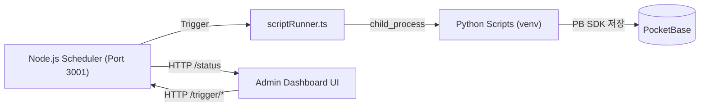

# 06. 시스템 스케줄러 아키텍처 (System Scheduler)

이 문서는 ClosingSHIN의 백그라운드 작업을 관리하는 **중앙 집중식 스케줄러(Centralized Scheduler)**에 대해 설명합니다.

---

## 1. 스케줄러 아키텍처 개요

Node.js (`node-cron`) 기반의 중앙 제어 방식을 채택했습니다. 프론트엔드와 동일한 JS/TS 생태계에서 파이썬 워커들을 제어합니다.



### 특장점
- **단일 제어 타워:** `backend/scheduler.ts`에서 모든 작업 관리
- **파이프라인 제어:** `async/await`를 통해 '시장 데이터 갱신 -> 포트폴리오 재계산'과 같은 의존성 체이닝
- **가상환경(venv) 자동 감지:** `backend/scriptRunner.ts`가 OS 환경에 맞춰 Python 경로 자동 감지
- **중복 실행 방지:** 각 작업의 `status === 'running'` 체크로 동시 실행 차단

### 실행 방법
```bash
# 스케줄러 단독 실행 (Port 3001)
cd frontend
npm run scheduler
```

---

## 2. 관리 중인 예약 작업 (Scheduled Jobs)

| 작업 (Job) | 실행 주기 | 스크립트 | 주요 기능 | PB 컬렉션 |
|---|---|---|---|---|
| **Market Data Update** | `*/10 * * * *` (10분) | `05_collect_market_status.py` | 최신 KOSPI/KOSDAQ 지수 현황, 환율, 투자자 동향 수집 | `market_status`, `settings` |
| **Portfolio Calculation** | Market Data 직후 (체이닝) | `07_calc_portfolio.py` | 진행 중(OPEN)인 포트폴리오 실시간 현재가 및 손익 갱신 | `settings` |
| **VCP Scan** | 매일 `15:40` KST | `02_scan_vcp.py` -> `03_visualize_vcp.py` | 장 마감 후 전 종목 VCP 패턴 탐지 + 차트 생성 | `vcp_reports`, `vcp_charts` |
| **Stock Info Update** | 수동 트리거 | `06_collect_stock_data.py` | VCP 후보 종목의 재무/수급 데이터 수집 | `stock_infos` |
| **Missing Data Recovery** | 수동 트리거 | `regenerate_missing_data.py` | 최근 7일간 누락된 과거 데이터 복구 | `stock_infos` |
| **Exit Monitor** | `*/10 9-15 * * 1-5` (장중 10분) + `0 18 * * 1-5` (장마감) | `exit_monitor.py` | 보유 종목 손절/익절 조건 체크 및 데스크탑 알림 | 로그 기록 |

### 작업 의존성 관계
```
Market Data Update (10분마다)
  └─> Portfolio Calculation (자동 체이닝)

VCP Scan (15:40)
  └─> Chart Visualization (자동 체이닝)
```

---

## 3. 프론트엔드 연동 (Admin Page)

스케줄러의 제어권은 유지보수 전용 공간인 `/admin` 페이지에 통합되어 있습니다.

- **접근 경로:** Header 우측 톱니바퀴 (ADMIN) 메뉴
- **주요 기능:**
  - **상태 모니터링:** `Idle` (대기 중), `Running` (실행 중), `Error` 상태 시각적 제공
  - **수동 트리거:** `RUN` 버튼을 통해 정해진 스케줄 이외에도 언제든 즉시 작업 강제 실행 가능
  - **로그 뷰어:** PocketBase `system_logs` 컬렉션 기반 실시간 로그 조회
  - **서버 상태:** 3001번 포트로 통신하며 스케줄러 서버의 응답 여부를 Live 상태 아이콘으로 표시

### HTTP API (Port 3001)
| Endpoint | 용도 |
|---|---|
| `GET /status` | 모든 작업의 현재 상태 JSON 반환 |
| `GET /trigger/market` | 시장 데이터 업데이트 즉시 실행 |
| `GET /trigger/vcp` | VCP 스캔 즉시 실행 |
| `GET /trigger/stock` | 주식 정보 업데이트 즉시 실행 |
| `GET /trigger/recovery` | 누락 데이터 복구 즉시 실행 |
| `GET /trigger/exit` | 장중 감시 즉시 실행 |
| `GET /trigger/portfolio` | 포트폴리오 계산 즉시 실행 |
