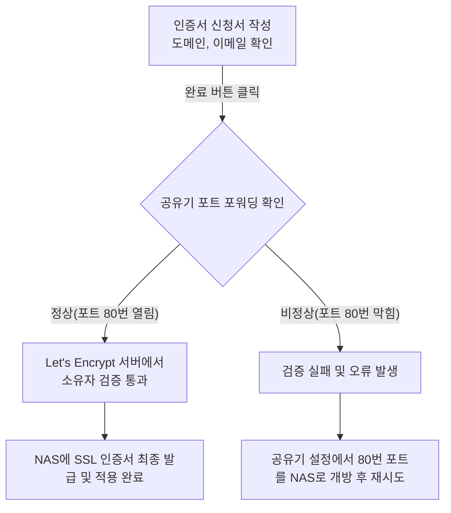

# Synology NAS Let's Encrypt 인증서 발급 가이드

## 1. 개요
브라우저 주소창에서 `http://` 대신 자물쇠 모양과 함께 표시되는 `https://`를 사용하기 위해서는 SSL 인증서가 필요합니다. 이 인증서는 일종의 보증서와 같아서, 서버와 사용자 간의 통신이 암호화되어 안전하다는 것을 증명해 줍니다. 

Synology NAS에서는 전 세계적으로 무료로 인증서를 발급해주는 기관인 **Let's Encrypt**를 통해 이 보증서를 아주 쉽게 받을 수 있습니다.

## 2. 인증서 발급 화면 설명

이미지에 첨부해주신 창은 이 Let's Encrypt 인증서를 받기 위한 신청서 양식입니다. 각 항목을 고등학생도 이해할 수 있도록 쉽게 예를 들어 설명해 드리겠습니다.

### A. 도메인 이름 (Domain name)
- **개념**: 우리 집의 공식적인 도로명 주소와 같습니다.
- **예시**: 화면에 입력된 `drspike.synology.me`는 발급하려는 메인 주소입니다. 이 주소에 대해서 "우리가 진짜 이 주소의 주인입니다"라고 증명하는 인증서를 받게 됩니다.
- **작성 방법**: 이미 신청 과정에서 선택했기 때문에 자동으로 기입되어 있습니다. 수정할 필요가 없습니다.

### B. 이메일 (Email)
- **개념**: 우체통이나 비상 연락처와 같습니다.
- **설명**: Let's Encrypt에서 발급하는 무료 인증서는 유효기간이 90일(약 3개월)입니다. 하지만 Synology NAS는 똑똑해서 만료일이 다가오면 스스로 기간을 연장(갱신)합니다. 만약 인터넷 연결 문제 등으로 혼자 연장하지 못하면, 여기에 적어둔 이메일(`lakisisfss@gmail.com`)로 "인증서가 곧 만료됩니다!"라고 알려줍니다.
- **작성 방법**: 평소 자주 확인하는 메일 주소를 적어두면 됩니다.

### C. 주제 대체 이름 (Subject Alternative Name, 본문에서는 주로 SAN이라고 부름)
- **개념**: 우리 집 도면에서 정문 말고도 있는 뒷문이나 옆문 주소를 의미합니다. 정문 (도메인 이름) 말고도 다른 주소로 접속했을 때도 인증서가 보장해주도록 추가하는 것입니다.
- **예시**: 만약 NAS 안에서 사진을 관리하는 앱 전용 주소인 `photo.drspike.synology.me`, 파일 관리 전용 주소인 `drive.drspike.synology.me` 등을 별도로 만들어서 쓰고 있다면, 이 주소들도 안전해야 합니다. 
- **작성 방법**: 
    - 만약 다른 세부 주소를 쓰지 않고 그냥 **`drspike.synology.me` 하나로만 접속한다면 이 칸은 비워두셔도 됩니다.** 
    - 만약 추가할 주소가 여러 개 있다면, 세미콜론(`;`)으로 구분해서 적어야 합니다. 
    - 예시: `photo.drspike.synology.me;drive.drspike.synology.me`
    - *(참고: 화면의 흐릿한 글씨인 `*.example.com`은 와일드카드라고 해서 "이 주소 앞에는 어떤 단어가 와도 다 허용해줘!"라는 뜻인데, 일반적인 이 환경에서는 복잡한 과정이 추가되므로 추천하지 않습니다.)*

## 3. 발급 진행 과정 시각화

## 4. 마지막 관문: 포트 포워딩 (주의사항)

"완료" 버튼을 누르기 전에 가장 중요한 것이 있습니다. 

Let's Encrypt라는 외국 기관에서는 우리가 `drspike.synology.me`의 진짜 주인인지 어떻게 알까요? 그들은 인터넷을 통해 우리 주소의 **80번 정문(포트 80번)**을 똑똑 두드려 봅니다. 

따라서 사용 중이신 집의 공유기(예: IPTIME 등) 설정에서 **80번 포트로 들어오는 외부 손님을 Synology NAS로 안내해주도록 길을 뚫어놓아야(포트 포워딩)** 합니다. 만약 이 길이 막혀있다면 인증서 발급은 무조건 실패하게 됩니다.

## 5. 최종 행동 지침
1. **주제 대체 이름** 항목은 특별한 하위 도메인이 없다면 그냥 **빈칸으로 둡니다.**
2. 공유기의 **80번 포트가 NAS로 포트 포워딩** 되어 있는지 한 번 확인합니다.
3. 파란색 **[완료]** 버튼을 클릭합니다.
4. NAS가 열심히 서버와 통신하며 로딩을 한 뒤 발급이 완료됩니다.
