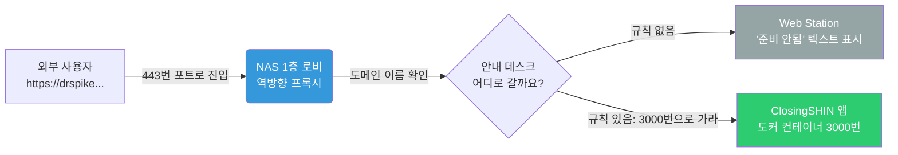

# Synology NAS 역방향 프록시(Reverse Proxy) 설정 가이드

## 1. 지금 에러 화면이 뜨는 이유 파악하기

보내주신 "Your website is not set up yet" 화면은 에러가 아닙니다. **인증서는 정상적으로 잘 받아졌고, 도메인 접속도 아주 잘 되고 있다는 증거입니다!**

그렇다면 왜 우리가 띄우려는 'ClosingSHIN' 앱 대신 NAS의 기본 화면이 나올까요?

- 우리가 만든 앱은 컨테이너 안방인 **3000번 포트**에서 놀고 있습니다.
- 하지만 외부 손님(나)이 인터넷 주소창에 `drspike.synology.me`를 치고 들어오면, 기본적으로 80번이나 443번 정문을 통과해 **NAS의 1층 로비(Web Station)**로 들어오게 됩니다.
- 1층 로비 안내데스크에서는 손님을 어디로 보내야 할지 모르기 때문에 "아직 준비된 웹사이트가 없어요"라는 로비 기본 화면을 보여주는 것입니다.

## 2. 해결책: 역방향 프록시 (Reverse Proxy)

우리는 이제 1층 로비 안내데스크(NAS 설정)에게 **"앞으로 `drspike.synology.me`를 찾아서 443번 정문으로 들어오는 손님은 무조건 3000번 방(ClosingSHIN)으로 안내해줘!"**라고 지시를 내려야 합니다.

전문 용어로 이것을 **역방향 프록시(Reverse Proxy)** 설정이라고 부릅니다.

## 3. 역방향 프록시 설정 방법 (1단계~3단계)

NAS의 바탕화면에서 **제어판**을 엽니다.

### 1단계: 역방향 프록시 규칙 만들기
1. 제어판 > **로그인 포털** (또는 응용 프로그램 포털) 메뉴로 들어갑니다.
2. 상단 탭에서 **고급**을 누릅니다.
3. **역방향 프록시** 버튼을 클릭하고 **생성**을 누릅니다.
4. 아래와 같이 똑같이 입력해 주세요:

* **[일반] 탭 영역**
  * **역방향 프록시 이름**: `ClosingSHIN APP` (아무렇게나 적어도 됩니다)
  * **소스 (외부에서 들어오는 손님)**
    * 프로토콜: **HTTPS** (우리가 방금 보안 인증서를 땄으니까 이걸 고릅니다)
    * 호스트 이름: `drspike.synology.me` (본인의 도메인)
    * 포트: **443**
  * **대상 (안내해 줄 방 번호)**
    * 프로토콜: **HTTP**
    * 호스트 이름: `localhost` (또는 NAS의 내부 IP 인 `192.168.x.x`)
    * 포트: **3000** (우리의 Next.js 앱 포트)

모두 적었으면 **저장**을 누릅니다.

### 2단계: 인증서 짝지어주기 (매우 중요)
로비 직원이 손님을 3000번 방으로 안내할 때, 아까 우리가 만든 **Let's Encrypt 보증서(인증서)를 목에 걸고 안내하도록** 짝을 지어줘야 합니다.

1. 제어판 > **보안** > **인증서** 탭으로 이동합니다.
2. 상단의 **설정** 버튼을 클릭합니다.
3. 서비스 목록을 쭈욱 내리다 보면 방금 만든 `drspike.synology.me` (역방향 프록시) 항목이 보일 겁니다.
4. 이 항목 옆의 드롭다운 메뉴를 눌러서, 방금 발급받았던 **Let's Encrypt 인증서**를 선택하고 확인을 누릅니다.

### 3단계: 브라우저 접속 확인
이제 웹 브라우저 캐시를 지우거나, **시크릿 모드(새 InPrivate 창)**를 열어 도메인으로 접속해 보세요.
- 접속 주소: `https://drspike.synology.me`

이제 1층 로비를 거치지 않고 바로 3000번 방의 ClosingSHIN 앱 화면이 안전한 자물쇠 모양과 함께 열릴 것입니다!

## 4. 로비 안내 시스템 시각화 (동작 원리)

