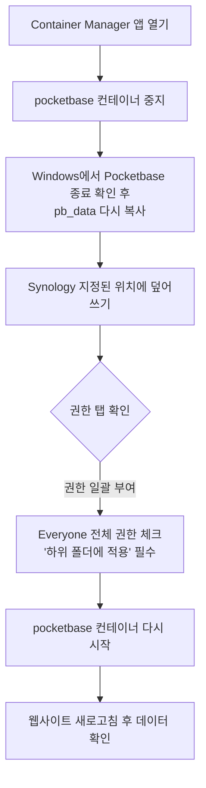

# PocketBase 데이터(pb_data) Synology 이관 및 트러블슈팅

## 1. 문제 상황 인식
로컬(Windows 등)에서 잘 작동하던 프로젝트를 Synology NAS 환경의 Docker로 배포하고 접속했을 때, 웹사이트는 뜨지만 아래와 같은 에러가 발생하는 경우가 있습니다.

> **에러 문구**: 
> `SYSTEM OFFLINE: No Data Found`
> `Please run the Python collection scripts first.`

이것은 웹 브라우저에서 Next.js 프론트엔드 앱까지는 성공적으로 접속했지만, 프론트엔드가 데이터를 가져와야 할 **PocketBase(데이터베이스) 내부가 텅 비었거나 읽을 수 없는 상태**임을 뜻합니다.

## 2. 발생 원인과 해결 방법 (3가지)

Windows 컴퓨터에 있던 원본 `pb_data` 폴더를 Synology로 업로드했을 때 발생하는 가장 흔한 3가지 원인입니다.

### 원인 1: 폴더 위치 경로 불일치 (가장 흔함)
Docker Compose 설정 파일에는 `volumes: - ./pb_data:/pb_data` 라고 적혀 있습니다. 이는 `docker-compose.yml` 파일이 위치한 폴더 **바로 같은 곳(옆)**에 `pb_data` 폴더가 있어야 한다는 뜻입니다. 

- **문제**: 만약 폴더 이름에 오타가 있거나(예: `pd_data`), 상위 폴더 등에 잘못 업로드된 경우, Docker는 "어? 데이터베이스 폴더가 없네? 새로 만들어야지" 하고 완전히 **새로운 깡통 데이터베이스**를 만들어 버립니다. 그래서 들어가 보면 데이터가 하나도 없는 것입니다.
- **해결책**: Synology File Station을 열고 `docker-compose.yml` 파일과 `pb_data` 폴더가 정확히 나란히 있는지 확인합니다. 만약 깡통 폴더가 생겼다면 지우고, 원본 폴더를 올바른 위치에 다시 덮어씌워 줍니다.

### 원인 2: 복사 과정 중 파일 누락 및 손상
PocketBase가 사용하는 SQLite라는 데이터베이스는 작동 중에 임시 파일들을 생성합니다.

- **문제**: 만약 Windows에서 PocketBase를 **켜둔 상태로 복사**를 진행했다면, 최신 데이터가 담긴 임시 파일(`data.db-wal`, `data.db-shm`)이 복사되지 않았거나, 파일이 깨진 상태로 전송되었을 수 있습니다.
- **해결책**:
  1. Windows 컴퓨터의 터미널이나 백그라운드에서 실행 중인 PocketBase를 **완전히 종료**합니다.
  2. 그 상태에서 `pb_data` 폴더 안의 파일들(특히 `data.db`, `data.db-wal` 등)이 모두 존재하는지 확인하고, 다시 통째로 압축해서 Synology로 안전하게 복사합니다.

### 원인 3: 폴더 접근 권한(Permission) 문제
Synology NAS는 리눅스 기반 보안 시스템을 철저하게 따릅니다. 

- **문제**: 사용자가 File Station을 통해 업로드한 폴더/파일은 기본적으로 '업로드한 본인'만 읽고 쓸 수 있습니다. 그런데 Docker 내부에서 돌고 있는 PocketBase 프로그램은 본인이 아니기 때문에 "접근 권한이 없습니다" 라며 파일을 읽지 못해 아예 새로운 빈 파일을 생성했을 수 있습니다.
- **해결책**:
  1. Synology File Station에서 `pb_data` 폴더 위에 마우스 우클릭 -> **속성**을 누릅니다.
  2. **권한** 탭으로 이동합니다.
  3. 상단 메뉴에서 돋보기 모양의 '권한 검사자'가 아닌, **[생성]** 버튼이나 기존 항목의 **[편집]** 버튼을 클릭해야 합니다. (그러면 '권한 편집기' 창이 열리며 체크박스를 클릭할 수 있습니다.)
  4. 알맞게 열린 편집기 창에서, 사용자에 `Everyone`을 선택하고 **모든 권한(읽기/쓰기/실행)**을 전부 허용해 줍니다.
  5. 왼쪽 하단의 **[이 폴더, 하위 폴더 및 파일에 적용]** 체크박스를 꼭! 체크하고 저장합니다.

> 🚨 **주의: 권한 체크박스가 회색으로 잠겨서 클릭이 안 되나요?**
> - **'권한 검사자' 창을 연 경우**: [권한 검사자]는 눈으로 확인만 하는 뷰어 창입니다. 이 창을 닫고 반드시 **[생성]** 또는 **[편집]** 버튼을 눌러 **'권한 편집기'** 창을 열어주세요.
> - **'권한 편집기' 창에서도 잠겨 있는 경우**: 상위 폴더의 권한을 그대로 따르기(상속)로 설정되어 있기 때문입니다. 이전 빈 화면 상단의 **[고급 옵션] -> [상속된 권한을 명시적 실체 권한으로 만들기]**를 눌러주시면 자물쇠가 풀립니다.

### 원인 4: 환경변수 이름 불일치 (내부 통신 단절)
`pb_data` 권한과 복사가 모두 완벽했다면, 프론트엔드 코드와 Docker 간의 **'명찰 이름(환경변수)'이 달라서 발생한 버그**일 확률이 높습니다.

- **문제**: 우리가 만든 Next.js 코드는 백엔드 주소를 찾을 때 **`PB_URL`** 이라는 이름이 적힌 명찰을 찾도록 코딩되어 있습니다. 그러나 기존에 작성된 `docker-compose.yml`에는 **`POCKETBASE_URL`** 이라고 길게 오타가 난 명찰을 달아주었습니다. 
결과적으로 프론트엔드는 백엔드를 찾지 못해 혼자 "빈 창고네!" 하고 Offline을 띄워버린 것입니다.
- **해결책**:
  1. Synology에 올라가 있는 `docker-compose.yml` 파일을 엽니다.
  2. `closingshin` 서비스 쪽의 환경 변수를 찾아서 아래와 같이 딱 한 줄만 수정합니다.
     - 수정 전: `- POCKETBASE_URL=http://pocketbase:8080`
     - **수정 후: `- PB_URL=http://pocketbase:8080`**
  3. 파일을 저장한 뒤, 도커 컨테이너를 다시 배포(새로고침) 해줍니다.

## 3. 요약: 복구 절차 시각화 (권장 순서)

위 순서대로 차근차근 점검을 완료하면 문제없이 기존 데이터를 불러올 수 있게 됩니다.
