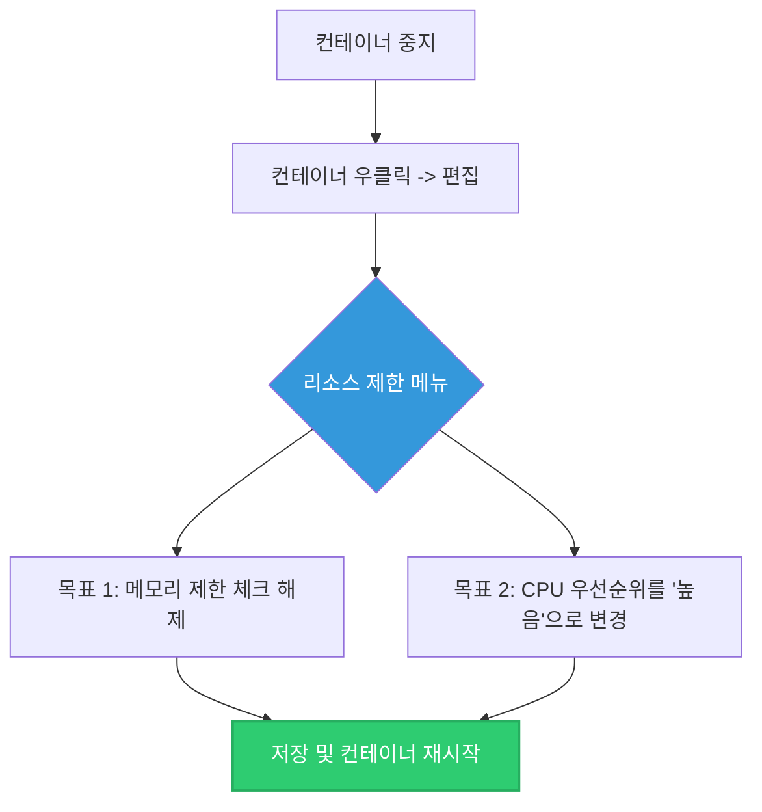

# Synology NAS 도커(Container Manager) 환경 최적화

코드를 수정하지 않고 하드웨어적 접근으로 성능을 끌어올리고자 할 때 검토할 수 있는 Synology NAS의 컨테이너 리소스 설정 방법입니다.

## 1. 도커 컨테이너의 하드웨어 할당 원리
가장 먼저 알아두셔야 할 핵심은 이렇습니다: 
**Docker 컨테이너는 기본적으로 NAS 기기가 가진 모든 CPU와 RAM 자원을 제한 없이 100% 끌어다 쓸 수 있도록 설정되어 있습니다.**

가상머신(Virtual Machine)처럼 "나 램 2GB만 줘" 하고 떼어가는 방식이 아닙니다. 따라서 사용자가 의도적으로 리소스를 '제한'하지 않았다면, 이미 NAS가 낼 수 있는 최대의 속도로 데이터베이스와 웹 서버를 굴리고 있는 것입니다. 

## 2. 리소스 설정 확인 및 최고 성능 모드 풀기
혹시나 컨테이너를 생성할 때 무의식적으로 자원을 묶어두었을 수도 있습니다. 이를 최대로 풀어주는 설정 경로는 다음과 같습니다.

1. Synology의 **Container Manager** (구 Docker) 앱을 엽니다.
2. 좌측 메뉴에서 **[컨테이너]**를 누릅니다.
3. 느린 속도의 주범이 될 수 있는 `closingshin` 및 `pocketbase` 컨테이너를 마우스로 클릭하고, 상단의 **[중지(종료)]** 버튼을 누릅니다. (꺼져 있어야 편집이 가능합니다.)
4. 중지된 컨테이너를 우클릭하고 **[편집]** 과 **[고급 설정]** 메뉴로 들어갑니다. (DSM 버전에 따라 바로 편집 화면이 나타나기도 합니다.)

### 📌 체크해야 할 항목
- **메모리(RAM) 제한 체크 해제**: `메모리 한계` 또는 `Memory Limit`라고 적혀 있는 곳의 체크박스를 해제하세요. (만약 해제할 수 없다면, NAS의 전체 램 용량에 가깝게 매우 큰 숫자로 늘려줍니다.)
- **CPU 우선순위 높임**: `CPU 우선순위`를 **[높음(High)]**으로 설정합니다. 이렇게 하면 NAS가 다른 일(사진 백업, 파일 복사 등)을 할 때보다 먼저 이 컨테이너의 작업을 1순위로 처리합니다.

5. 설정을 마쳤다면 모두 저장하고, 컨테이너를 **[시작]** 합니다.

## 3. 하드웨어 설정의 한계점
CPU 우선순위를 '높음'으로 바꾸면 일시적인 버벅임은 줄어들 수 있습니다. 하지만 Synology NAS의 CPU(일반적으로 Celeron이나 모바일용 저전력 칩셋) 자체가 데스크탑에 비해 연산 속도가 매우 느린 편입니다.

만약 코드가 병렬(동시에 여러 데이터를 통째로 다운로드)이 아닌 직렬(하나 끝나면 다음 하나를 시작) 방식으로 짜여 있다면, 일꾼(CPU)에게 영양제를 아무리 많이 먹여도 결국 **물건을 나르는 트럭 자체가 한 대뿐인 상황**이라 근본적인 속도는 크게 나아지지 않을 수 있습니다.

따라서 최고 성능 모드를 켰는데도 여전히 3~4초 이상 "LOADING..."이 뜬다면, 그땐 하드웨어의 문제가 아닌 통신 방식의 문제이므로 병렬 통신 코드 수정(Promise.all 등)을 적용해야 합니다.

이 문서는 사용자의 NAS 관리 편의성을 위해 기본 트러블슈팅 가이드로 유지됩니다.
