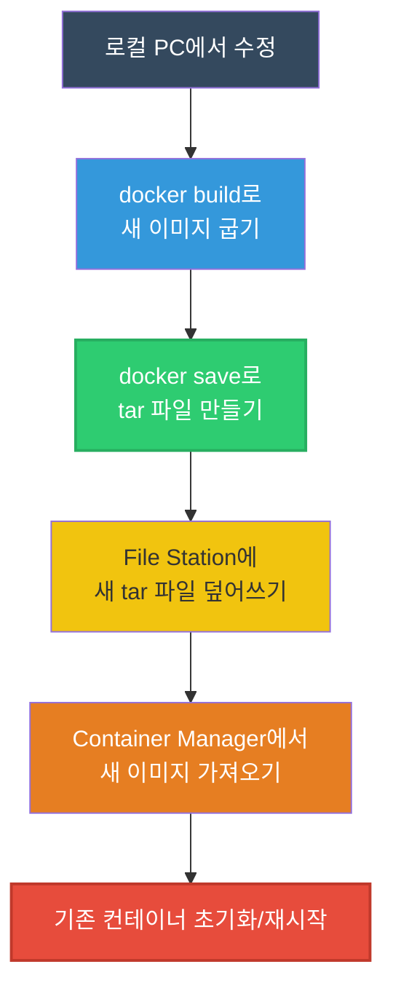

# 🚀 프론트엔드 코드 수정 후 도커(Docker) 재배포 가이드

Next.js나 React 같은 프론트엔드 코드(`.tsx` 파일 등)를 로컬 컴퓨터에서 변경했다면, 이 바뀐 코드는 현재 내 컴퓨터(PC)에만 존재합니다. 따라서 **"변경된 코드가 새로 포장된 도커 이미지"**를 다시 만들어서 Synology NAS에 새로 넣어주어야 합니다.

이전에 하셨던 방식(이전 사진에서 `closingshin.tar`를 복사하신 방식)을 토대로, 가장 확실하고 안전한 업데이트 절차를 정리해 드립니다.

## 1단계: 로컬 PC에서 새 이미지 굽고 포장하기 (Build & Save)

먼저 현재 작업 중인 VS Code 터미널에서 기존처럼 이미지를 새로 만들고 `tar` 파일로 추출합니다.

1. **새 이미지 빌드하기 (요리하기)**
   ```bash
   # 터미널에서 기존처럼 빌드 명령어를 실행합니다.
   docker build -t closingshin:latest .
   ```
2. **새 이미지 파일로 뽑아내기 (포장하기)**
   ```bash
   # 방금 만든 따끈따끈한 이미지를 다시 tar 파일로 묶어줍니다.
   docker save -o closingshin.tar closingshin:latest
   ```

## 2단계: Synology NAS로 새 이미지 배송하기 (Upload)

1. Synology DSM(바탕화면)에 접속합니다.
2. **File Station**을 엽니다.
3. 이전에 `closingshin.tar` 파일을 올리셨던 폴더(`docker/closingshin` 등)로 이동합니다.
4. 로컬 PC에서 방금 새로 포장한 `closingshin.tar` 파일을 마우스로 끌어다 떨어뜨려(드래그 앤 드롭) 기존 파일을 **덮어쓰기(Overwrite)** 합니다.

## 3단계: 기존 헌 컨테이너 지우고 새 이미지 입히기 (Deploy)

기존에 돌고 있던 컨테이너는 "과거의 낡은 코드"를 품고 있으므로 멈추고 새것으로 갈아 끼워야 합니다.

1. **[Container Manager]** 앱을 엽니다.
2. **[이미지]** 탭으로 갑니다.
3. 상단의 **[가져오기(Import)]**를 누르고, 방금 File Station에 덮어쓴 `closingshin.tar` 파일을 선택하여 이미지를 NAS에 새로 입수합니다. (이름은 `closingshin:latest` 로 지정)
4. **[프로젝트]** 탭으로 이동합니다.
5. 현재 `closingshin` 프로젝트를 우클릭(또는 체크)하고 **[중지]**를 눌러 완전히 끕니다.
6. 프로젝트를 다시 **[시작(또는 빌드)]** 합니다.
   - *팁: 만약 프로젝트 탭 대신 [컨테이너]를 직접 만드셨다면, 기존 closingshin 컨테이너를 중지 -> 우클릭 후 '초기화(재설정)' -> 다시 '시작' 하시면 깔끔하게 새 이미지를 물고 켜집니다.*

---



이 과정을 마치시면 이전에 경험하셨던 '캘린더 버벅임'이 완전히 사라진 최신 버전의 대시보드를 NAS 환경에서도 만나보실 수 있습니다!
