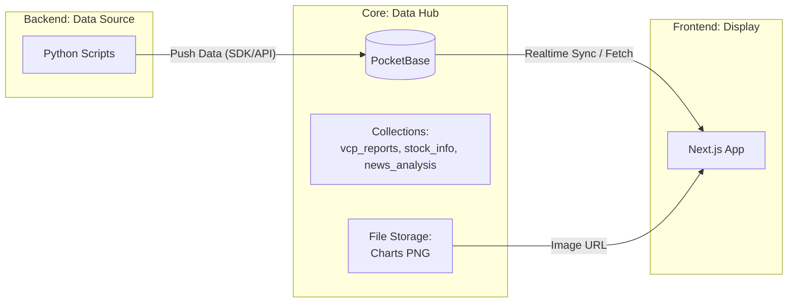

# PocketBase 마이그레이션 분석 (Migration Analysis)

본 문서는 프로젝트 'ClosingSHIN'의 데이터 관리 체계를 현재의 로컬 파일 시스템(CSV, JSON, PNG) 기반에서 PocketBase로 전환하기 위한 분석 및 계획을 담고 있습니다.

## 1. 전환 배경 및 목적

### 현재 체계의 한계
- **데이터 파편화**: Scripts 폴더와 results 폴더에 수백 개의 CSV 파일이 분산되어 있어 추적 및 관리가 어렵습니다.
- **프런트엔드 의존성**: Next.js 프런트엔드가 서버의 파일 시스템(fs 모듈)에 직접 접근해야 하므로 서버 환경에 강하게 결합되어 있습니다.
- **동기화 이슈**: 데이터가 업데이트될 때마다 파일이 새로 생성되어야 하며, 다수의 스케줄러가 동시에 파일을 수정할 때 동시성 문제가 발생할 위험이 있습니다.

### PocketBase 도입의 장점
- **통합 API**: 모든 데이터(주가, 리포트, 뉴스 분석)와 파일을 단일 REST API로 관리할 수 있습니다.
- **실시간성**: SQLite 기반의 가벼운 성능과 실시간 구독(Realtime subscription) 기능을 통해 데이터 변화를 프런트엔드에 즉시 반영할 수 있습니다.
- **관리 대시보드**: 데이터를 엑셀처럼 쉽게 확인하고 수정할 수 있는 어드민 패널을 기본 제공합니다.
- **파일 서빙**: 차트(PNG) 이미지를 PocketBase 본체에서 직접 서빙하므로 별도의 정적 파일 서버 설정이 불필요합니다.

---

## 2. 마이그레이션 전략

### 옵션 A: 핵심 데이터 DB화 (권장)
사용자가 직접 확인하는 최종 분석 데이터(VCP 리포트, 뉴스 분석, 통합 스코어)를 최우선으로 PocketBase에 넣습니다.

1. **컬렉션 설계**:
    - `vcp_reports`: 리포트 날짜, 종목코드, VCP 점수, 피벗 가격 등 저장.
    - `stock_infos`: 수급, 펀더멘털 스코어 저장.
    - `news_analysis`: 뉴스 제목, 링크, AI 분석 결과 및 감성 점수 저장.
    - `market_status`: 시장 위험 지수 및 현황 저장.
2. **파일 필드 활용**:
    - `vcp_reports` 컬렉션에 `chart_image` 필드를 추가하여 직접 PNG 차트를 업로드합니다.

### 옵션 B: 완전한 서버리스 전환
로컬 Scripts에서 생성하는 모든 중간 단계 데이터(과거 주가 데이터 등)까지 모두 DB화합니다. 이는 데이터 양이 많아질 경우 SQLite 파일의 크기가 비대해질 수 있으므로 점진적인 적용이 필요합니다.

---

## 3. 코드 수정 범위

### 백엔드 (Python Scripts)
- `pandas.to_csv()` 호출부를 `pocketbase-python-sdk`를 이용한 레코드 생성 로직으로 교체합니다.
- 차트 생성 전후로 PocketBase API를 통해 파일을 전송하는 로직을 추가합니다.

### 프런트엔드 (Next.js)
- `src/lib/api.ts` 에서 `fs` 모듈을 이용한 파일 읽기 로직을PocketBase 클라이언트(`.getOne`, `.getList`)로 전환합니다.
- `types.ts`의 인터페이스를 PocketBase의 스키마와 일치시키기 위해 업데이트합니다.

---

## 4. 인프라 구성 (Docker)

기존 `docker-compose.yml`에 PocketBase 서비스를 추가하여 사이드카 형태로 운영합니다.

```yaml
services:
  pocketbase:
    image: muchobien/pocketbase:latest
    container_name: pocketbase
    ports:
      - "8090:8080"
    volumes:
      - ./pb_data:/pb_data
    restart: unless-stopped
```

---

## 5. 단계별 로드맵

1. **준비기**: Docker Compose에 PocketBase 추가 및 컬렉션 스키마 정의.
2. **이행기**: 기존 CSV 데이터를 PocketBase로 일괄 업로드하는 마이그레이션 스크립트 작성 및 실행.
3. **통합기**: Python 분석 스크립트와 프런트엔드 API 로직을 신규 DB 기반으로 수정.
4. **최적화**: 로컬 파일 시스템 의존성을 완전히 제거하고 백업 체계(S3 등) 구축.

---

## 6. 데이터 흐름 시각화 (PocketBase Flow)

마이그레이션 완료 후의 새로운 데이터 파이프라인 흐름입니다.



---

## Socratic Gate: 전략 질문

본격적인 구현에 앞서 다음 질문에 대한 귀하의 생각이 궁금합니다:

1. **과거 데이터 포함 여부**: 현재 `results` 폴더에 쌓인 수개월치의 과거 CSV 리포트들도 모두 PocketBase로 이관하기를 원하시나요, 아니면 앞으로 생성될 데이터부터 적용하기를 원하시나요?
2. **클라우드 연동 계획**: 현재 Supabase를 일부 사용 중이신 것으로 보입니다. PocketBase와 Supabase의 역할 분담을 어떻게 생각하시나요? (예: 인증은 Supabase, 데이터 관리는 PocketBase 등)
3. **데이터 유지 관리**: 만약 수십만 건의 주가 데이터(Raw Data)가 쌓일 경우를 대비해 SQLite를 계속 사용할지, 아니면 대용량 데이터는 계속 파일로 유지할지에 대한 우선순위가 있으신가요?
