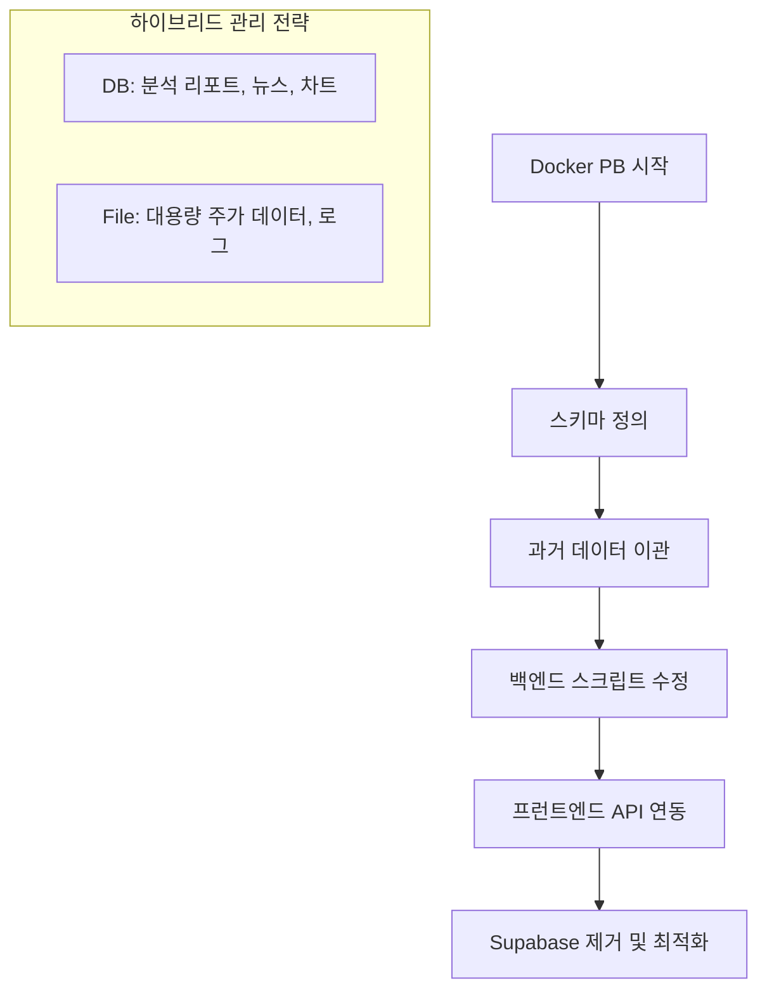

# 22. PocketBase 마이그레이션 작업 목록 (Migration Tasks)

이 문서는 프로젝트 'ClosingSHIN'의 데이터 관리체계를 PocketBase로 전환하고, 기존 Supabase 의존성을 완전히 제거하기 위한 단계별 작업 목록을 담고 있습니다.

## 1. 프로젝트 목표
- **완전 마이그레이션**: 모든 과거 CSV 리포트 및 이미지 파일을 PocketBase로 이관.
- **Supabase 제거**: 인증 및 데이터 관리를 PocketBase로 통합 (Supabase 미사용).
- **하이브리드 운영**: 핵심 분석 결과는 DB화하되, 대용량 기초 데이터는 로컬 파일 시스템에 유지.

---

## 2. 세부 작업 로드맵

### 1단계: 인프라 및 기반 구축
- [ ] **Docker Compose 설정**: PocketBase 컨테이너 서비스 추가 (`pb_data` 볼륨 매핑).
- [ ] **관리자 계정 생성**: 초기 PocketBase 어드민 계정 설정 및 API 권한 확인.
- [ ] **Python SDK 설치**: 분석 스크립트용 `pocketbase` 라이브러리 추가.

### 2단계: 컬렉션(DB) 스키마 설계
- [ ] **vcp_reports 컬렉션**: 날짜, 종목코드, 점수, 피봇, 차트 이미지(File) 필드.
- [ ] **news_analysis 컬렉션**: 뉴스 제목, 링크, AI 분석 요약, 감성 스코어.
- [ ] **stock_infos 컬렉션**: 외국인/기관 수급 점수, 펀더멘털 지표.
- [ ] **market_status 컬렉션**: 시장 위험 지표 및 데일리 현황.

### 3단계: 과거 데이터 대규모 이관 (Migration Script)
- [ ] **CSV 파서 작성**: `Scripts/results` 폴더의 수백 개 CSV 파일을 읽어오는 로직.
- [ ] **데이터 업로드**: 과거 리포트 데이터를 PocketBase 레코드로 변환하여 일괄 생성.
- [ ] **차트 이미지 업로드**: 날짜별 폴더에 저장된 PNG 파일을 PocketBase 파일 필드로 매칭하여 업로드.

### 4단계: 실시간 분석 파이프라인 수정
- [ ] **Python 스크립트 업데이트**: `02_scan_vcp.py`, `05_analyze_news.py` 등 결과 저장 로직을 API 전송으로 변경.
- [ ] **하이브리드 로직 적용**: 대용량 OHLCV 데이터는 기존처럼 로컬 CSV에 읽고 쓰되, 결과물만 DB로 전송.

### 5단계: 프런트엔드 연동 및 Supabase 제거
- [ ] **PocketBase SDK 통합**: Next.js 프런트엔드에 `pocketbase` JS SDK 설치.
- [ ] **API 레이어 리팩토링**: `src/lib/api.ts`의 `fs` 모듈 접근 코드를 PocketBase 호출로 교체.
- [ ] **Supabase 코드 제거**: Auth 및 기타 Supabase 관련 라이브러리 및 환경 변수 삭제.

---

## 3. 작업 시각화 (Workflow)

---

## 4. 최종 체크리스트
- [ ] 모든 과거 리포트가 PocketBase 어드민 패널에서 확인되는가?
- [ ] 프런트엔드 대시보드에서 API를 통해 데이터를 실시간으로 불러오는가?
- [ ] 분석 스크립트 종료 후 자동으로 DB에 레코드가 생성되는가?
- [ ] Supabase 관련 코드가 프로젝트에서 완전히 제거되었는가?
