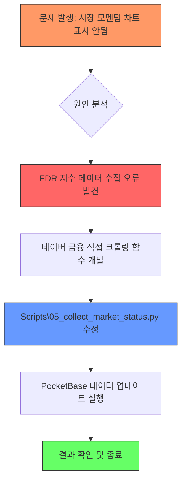

# 시장 모멘텀 그래프 수정 태스크 (Market Momentum Graph Fix)

## 1. 개요 (Overview)
*   **문제**: 메인 대시보드에서 'MARKET MOMENTUM' 차트가 데이터를 불러오지 못함 (History 데이터가 0개임)
*   **원인 분석**:
    *   `Scripts\05_collect_market_status.py` 내 `get_market_history` 함수가 `FinanceDataReader` (FDR)를 사용하여 코스피/코스닥 지수를 가져옴
    *   테스트 결과 FDR이 'KS11'(코스피) 및 'KQ11'(코스닥) 데이터 요청 시 `LOGOUT` 에러를 발생시키며 빈 데이터프레임을 반환함
    *   FDR의 내부 크롤링 엔진과 데이터 소스(네이버 금융 등) 간의 호환성 문제로 추정됨

## 2. 해결 전략 (Solution Plan)
1.  **데이터 수집 안정화**:
    *   지수 데이터(KOSPI, KOSDAQ)의 과거 이력을 가져올 때 FDR이 실패할 경우, 네이버 증권 페이지를 직접 크롤링하는 `scrape_naver_history` 기능을 추가하여 폴백(Fallback) 처리함
2.  **데이터 무결성 확인**:
    *   수집된 데이터가 올바른 형식(date, KOSPI, KOSDAQ)을 갖추고 있는지 검증 로직 추가
3.  **대시보드 반영**:
    *   수정된 스크립트를 실행하여 PocketBase의 최신 `market_status` 레코드에 `History` 데이터가 정상적으로 저장되도록 함

## 3. 진행 상황 시각화 (Progress Visualization)

- [x] 문제 인지 및 분석 (Analysis phase)
- [x] FDR 오류 확인 (FDR logout error confirmed)
- [x] 크롤링 함수 검증 (Scraping function verified)
- [x] Scripts\05_collect_market_status.py 수정 (Completed)
- [x] 데이터 수집 및 업데이트 (Completed)
- [x] 최종 화면 확인 (Data verification in PB completed)
