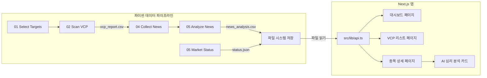

# ClosingSHIN 프론트엔드 구현 워크스루

## 1. 개요
우리는 **Next.js 14**와 **Tailwind CSS**를 사용하여 **"현대적인 학구파(Modern Academic)" 핀테크 대시보드**를 성공적으로 구축했습니다. 이 프론트엔드는 기존 파이썬 데이터 파이프라인과 완벽하게 통합되어, VCP 후보 종목과 AI 기반 뉴스 분석 결과를 시각화하여 보여줍니다.

## 2. 아키텍처
이 시스템은 파이썬이 데이터 처리의 무거운 작업을 담당하고, Next.js가 화면 표시를 담당하는 분리된 아키텍처를 따릅니다.



## 3. 주요 기능

### 바우하우스 디자인 시스템 (Bauhaus Design System)
- **컨셉**: "The Modern Academic" (학자풍 네이비 + 페이퍼 화이트)
- **기술**: Tailwind CSS와 커스텀 설정 (`tailwind.config.ts`)
- **컴포넌트**: `BentoGrid`(벤토 그리드), `MetricCard`(지표 카드), `StockCard`(종목 카드) 등 재사용 가능한 UI

### 실데이터 통합 (Real Data Integration)
- **대시보드 (Dashboard)**: `status_YYYYMMDD.json` 파일에서 KOSPI/KOSDAQ 현황 및 외국인 순매수(수급) 데이터를 가져와 표시합니다.
- **VCP 페이지**: `vcp_report.csv` 파일에서 스캔된 후보 종목(예: 삼성전자)과 패턴의 긴밀함(Tightness) 점수를 리스트로 보여줍니다.
- **종목 상세 (Stock Detail)**: 선택한 종목의 구체적인 VCP 지표와 `news_analysis.csv`에서 가져온 **AI 뉴스 분석(호재/악재 점수, 한 줄 요약)**을 표시합니다.

## 4. 실행 방법

### 1단계: 데이터 생성 (Python)
오늘 날짜의 데이터를 생성하기 위해 스크립트를 순서대로 실행하세요:
```bash
cd Scripts
# 1. 시장 현황 가져오기
python 05_collect_market_status.py

# 2. VCP 스캔 및 뉴스 분석 실행
python 02_scan_vcp.py
python 04_collect_news.py
python 05_analyze_news.py
```

### 2단계: 프론트엔드 실행
```bash
cd frontend
npm run dev
```
브라우저에서 `http://localhost:3000`으로 접속하여 대시보드를 확인하세요.

## 5. 파일 구조
- `Scripts/`: 파이썬 로직 및 `data/`, `results/` 데이터 저장소.
- `frontend/src/app/`: App Router 페이지 (`vcp`, `stock/[code]`).
- `frontend/src/lib/api.ts`: **핵심 유틸리티**. 파일 시스템의 결과물(CSV/JSON)과 리액트 컴포넌트를 연결해주는 다리 역할을 합니다.
