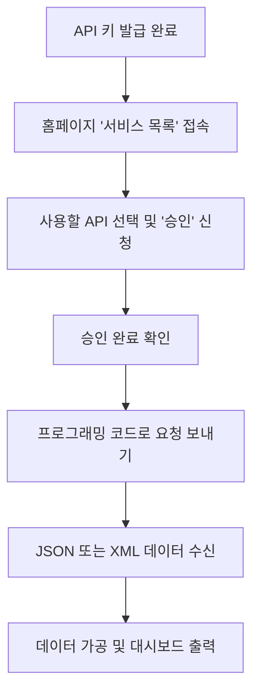

# KRX 오픈 API 활용 가이드

KRX(한국거래소)에서 제공하는 Open API는 우리나라 자본시장의 다양한 데이터를 프로그래밍 방식으로 가져올 수 있는 서비스입니다. 발급받은 키를 어떻게 활용할 수 있는지 고등학생도 이해하기 쉽게 설명해 드립니다.

## 1. 이 API로 무엇을 할 수 있나요?

KRX 오픈 API는 단순히 주식 가격만 알려주는 것이 아니라, 시장 전체의 흐름을 파악할 수 있는 방대한 데이터를 제공합니다.

### 제공되는 주요 데이터 종류
- **주식 정보**: 삼성전자 같은 개별 종목의 오늘 가격, 과거 시세, 상장된 주식 수 등을 알 수 있습니다.
- **지수 정보**: 코스피(KOSPI)나 코스닥(KOSDAQ) 지수가 어떻게 변했는지 확인할 수 있습니다.
- **증권상품**: ETF(상장지수펀드)나 ETN 같은 상품들의 상세 정보와 수익률 데이터를 가져올 수 있습니다.
- **투자자 동향**: 오늘 외국인이 주식을 많이 샀는지, 기관이 팔았는지와 같은 '수급' 데이터를 분석할 수 있습니다.
- **채권 및 파생상품**: 주식 외에도 국채 가격이나 선물, 옵션 같은 전문적인 금융 데이터도 포함되어 있습니다.

## 2. 구체적인 활용 예시

발급받은 키를 사용해 직접 다음과 같은 프로그램을 만들어 볼 수 있습니다.

### 나만의 주식 대시보드 만들기
웹사이트나 앱을 만들어서 내가 관심 있는 종목들의 가격과 그래프를 한 화면에 보여줄 수 있습니다. 엑셀에 일일이 입력할 필요 없이 버튼 하나로 최신 정보를 불러오게 할 수 있습니다.

### 자동 알림 봇 만들기
"코스피 지수가 3% 이상 떨어지면 나에게 메시지를 보내줘." 라는 기능을 만들 수 있습니다. 파이썬 같은 프로그래밍 언어를 이용해 API 데이터를 주기적으로 확인하고, 조건이 맞으면 텔레그램이나 디스코드로 알림을 보내는 방식입니다.

### 투자 전략 검증 (백테스팅)
과거 데이터를 대량으로 내려받아 "만약 내가 1년 전부터 매달 특정 조건의 주식을 샀다면 지금 수익이 얼마일까?"를 계산해 볼 수 있습니다. 실제 돈을 쓰지 않고도 자신의 투자 아이디어가 맞는지 시험해 볼 수 있는 아주 좋은 방법입니다.

## 3. API 사용 프로세스 (시각화)

API를 실제로 사용하기 위해서는 다음과 같은 단계를 거치게 됩니다.

## 4. 주의해야 할 점

- **개별 승인 필수**: 키를 발급받았더라도 사용하고 싶은 데이터(예: 종목 시세)마다 홈페이지에서 **[승인]** 버튼을 눌러야 합니다. 승인되지 않은 데이터는 요청해도 답변이 오지 않습니다.
- **비상업적 용도**: 개인적인 공부나 연구용으로 사용하는 것은 무료이고 자유롭지만, 이 데이터를 이용해 돈을 받는 유료 서비스를 만드는 것은 금지되어 있습니다.
- **하루 호출 한도**: 하루에 요청할 수 있는 횟수가 정해져 있습니다. 한 번에 너무 많은 데이터를 요청하면 잠시 차단될 수 있으니 주의해야 합니다.
- **데이터 업데이트**: 대부분의 데이터는 장이 끝나고 난 뒤 정제되어 올라옵니다. 실시간 단타 매매보다는 하루 단위의 분석이나 통계 작업에 더 적합합니다.

---
**문서 정보**
- **작성 목적**: KRX 오픈 API 활용법 정리 및 학습
- **최적화**: Obsidian (마크다운 형식)
- **저장 경로**: `E:\Downloads\Antigravity Project\ClosingSHIN\docs`
