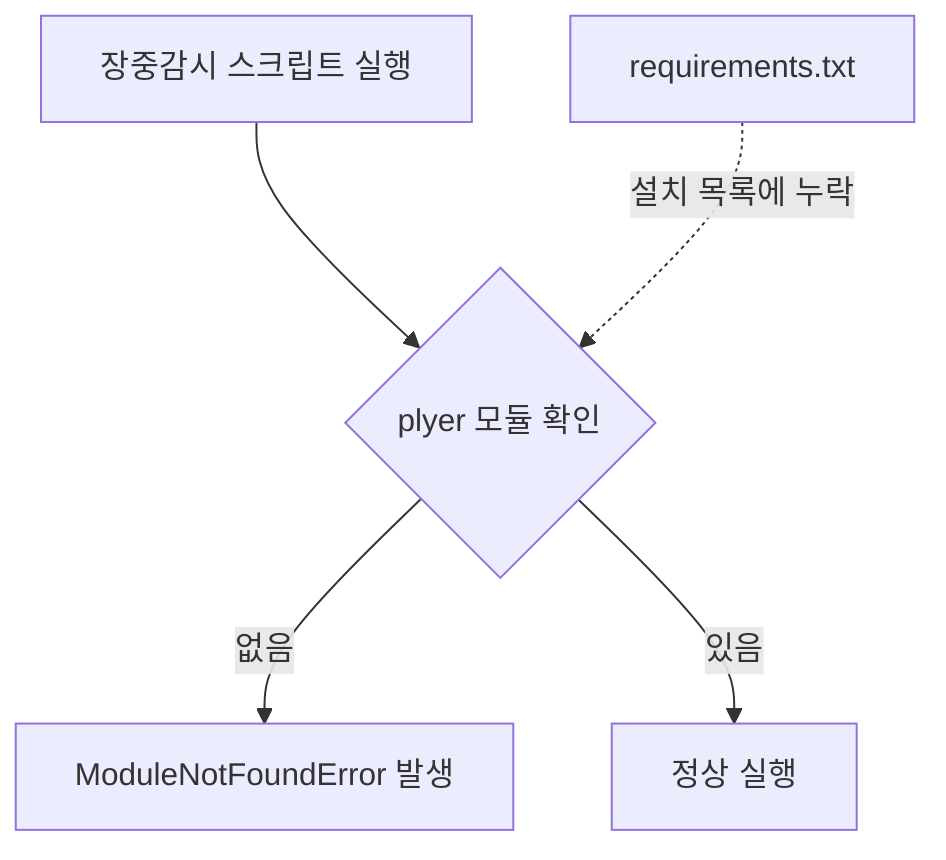
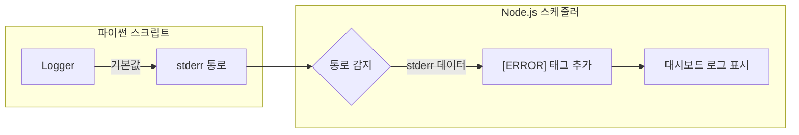

# 장중감시 및 시스템 로그 오류 원인 분석 보고서

이 보고서는 현재 시스템에서 발생하고 있는 두 가지 주요 오류의 원인을 분석하고 해결 방안을 제시합니다.

## 1. 장중감시(Intraday Monitoring) 오류 분석

### 오류 내용
- **오류 메시지**: `ModuleNotFoundError: No module named 'plyer'`
- **발생 위치**: `Scripts/exit_monitor.py` 실행 시

### 원인 분석
장중 감시 기능을 담당하는 `exit_monitor.py` 코드는 7번 라인에서 `plyer`라는 라이브러리를 가져와(import) 바탕화면 알림(Desktop Notification)을 보낼 때 사용합니다. 하지만 프로젝트의 의존성 관리 파일인 `requirements.txt`에 이 라이브러리가 등록되어 있지 않아, 도커 컨테이너가 빌드될 때 설치되지 않았습니다.

### 시각화 설명

---

## 2. 시스템 로그 'ERROR' 오표기 분석

### 오류 내용
- **현상**: 시스템 로그 터미널에서 정상적인 정보성 로그(`INFO`)임에도 불구하고 `[ERROR]`라는 머리글이 붙어서 출력됨.

### 원인 분석
이 현상은 파이썬의 **로깅 방식**과 백엔드(Node.js)의 **로그 수집 방식**의 차이에서 발생합니다.

1. **파이썬 측**: `07_calc_portfolio.py`와 `exit_monitor.py`는 로그를 화면에 출력할 때 기본적으로 '표준 에러(stderr)'를 사용합니다.
2. **백엔드 측**: 스케줄러(`scriptRunner.ts`)는 파이썬에서 보내주는 데이터 중 '표준 에러(stderr)'로 오는 모든 데이터를 "문제가 발생한 것"으로 간주하고 자동으로 `[ERROR]` 머리글을 붙여서 기록합니다.

즉, 내용은 '정상(INFO)'이지만, 전달 통로가 '에러 전용 통로(stderr)'였기 때문에 발생하는 오해입니다.

### 시각화 설명

---

## 3. 해결 방안

### 해결 1: 의존성 추가
- `requirements.txt` 파일에 `plyer==2.1.0`을 추가합니다.
- 이후 도커 이미지를 다시 빌드하여 라이브러리를 포함시킵니다.

### 해결 2: 로깅 통로 변경
- 파이썬 스크립트 내 로깅 설정에서 `logging.StreamHandler()`의 출력 대상을 `sys.stdout`(표준 출력)으로 명시합니다.
- 이렇게 하면 스케줄러가 이를 정상 정보로 인식하여 불필요한 `ERROR` 표시가 사라집니다.

---

> [!NOTE]
> 이 문서는 Obsidian에 최적화되어 있으며 이모티콘을 사용하지 않고 작성되었습니다.
