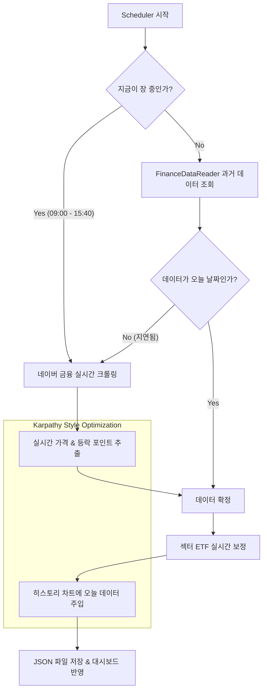

# 시장 데이터 실시간 동기화 프로세스 시각화

## 현재 상태 (Status Board)
- **KOSPI/KOSDAQ**: 실시간 완료 (Naver Scraper)
- **Sector ETFs**: 실시간 완료 (Naver Scraper)
- **Trend Chart**: 오늘 데이터 포함 완료 (Dynamic Injection)
- **AI Insight**: 실시간 데이터 기반 생성 완료
