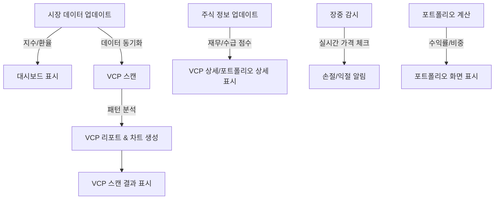

# ClosingSHIN 시스템 스케줄러 항목별 상세 정리

시스템 스케줄러의 각 항목이 어떤 역할을 수행하고, 어떤 데이터를 관리하며, 화면의 어디에 표시되는지 정리한 문서입니다.

## 1. 개요 및 시각화 (System Workflow)

전체 시스템은 시장 데이터를 수집하고, 이를 바탕으로 종목을 스캔하며, 내 포트폴리오를 관리하는 흐름으로 구성됩니다.

---

## 2. 항목별 상세 분석

### 🟢 시장 데이터 업데이트 (Market Data Update)
가장 기초가 되는 작업으로, 시장의 전반적인 분위기를 파악할 수 있는 지표를 가져옵니다.

- **실행 파일**: `Scripts/05_collect_market_status.py`
- **업데이트 위치**: 
    - PocketBase `market_status` 컬렉션 (날짜별 시황 데이터)
    - PocketBase `settings` 컬렉션 (최신 시황 정보 미러링)
- **주요 계산 항목**:
    - **시장 지수**: 코스피, 코스닥, 나스닥, 필라델피아 반도체 지수의 현재가 및 등락률
    - **거시 지표**: 원/달러 환율, 미국 10년물 국채 금리, WTI 유가
    - **시장 자금**: 고객 예탁금, 신용 잔고 현황
    - **투자자 동향**: 개인, 외국인, 기관의 시장별 순매수액
    - **AI 리포트**: 수집된 데이터를 바탕으로 AI가 생성한 '오늘의 시황 한 줄 요약'
- **UI 표시 위치**: 메인 대시보드 화면 상단의 시장 지표 섹션 및 AI Insight 영역

### 🔵 포트폴리오 계산 (Portfolio Calculation)
내가 보유한 종목들의 현재 가치와 수익 현황을 한눈에 볼 수 있도록 계산합니다.

- **실행 파일**: `Scripts/07_calc_portfolio.py`
- **업데이트 위치**:
    - `Scripts/data/portfolio_status.json` (프론트엔드 연동용 로컬 파일)
    - PocketBase `settings` 컬렉션 (포트폴리오 상태 백업)
- **주요 계산 항목**:
    - **평가 금액**: 보유 수량 × 실시간 현재가
    - **수익 현황**: 총 매입금액 대비 수익금(P&L) 및 수익률(%)
    - **자산 비중**: 전체 포트폴리오에서 각 종목이 차지하는 비율(Weight %)
    - **상태 요약**: 내 자산의 총합 및 최근 업데이트 시각
- **UI 표시 위치**: **포트폴리오(Portfolio)** 페이지 전체 (상단 요약 카드 및 보유 종목 테이블)

### 🔴 VCP 스캔 (VCP Scan)
마크 미너비니의 전략을 바탕으로 상승 가능성이 높은 종목을 자동으로 찾아냅니다.

- **실행 파일**: `Scripts/02_scan_vcp.py`, `Scripts/03_visualize_vcp.py`
- **업데이트 위치**:
    - PocketBase `vcp_reports` 컬렉션 (스캔 결과 데이터)
    - PocketBase `vcp_charts` 컬렉션 (분석 내용이 포함된 차트 이미지)
- **주요 계산 항목**:
    - **수축 패턴(VCP)**: 가격 파동의 수축 횟수(T) 및 마지막 수축폭(Depth %)
    - **VCP 점수**: 수축 횟수, 가격 밀집도, 거래량 급감을 종합한 100점 만점 점수
    - **상대강도(RS)**: 시장 대비 얼마나 강하게 상승 중인지 나타내는 점수
    - **피벗 포인트**: 돌파 매수 지점이 되는 가격대 및 현재가와의 거리
- **UI 표시 위치**: **VCP 스캔(VCP Scan)** 페이지 (순위 리스트 및 종목별 분석 차트)

### 🟡 주식 정보 업데이트 (Stock Info Update)
종목의 '기초 체력(재무)'과 '돈의 흐름(수급)'을 정밀 분석합니다.

- **실행 파일**: `Scripts/06_collect_stock_data.py`
- **업데이트 위치**: PocketBase `stock_infos` 컬렉션
- **주요 계산 항목**:
    - **재무 지표**: PER, PBR, EPS, BPS, 배당수익률 등
    - **수급 현황**: 외국인/기관의 기간별(5일~100일) 누적 순매수액
    - **재무 점수(Fundamental Score)**: 밸류에이션 및 이익 건전성 점수
    - **수급 점수(Supply Score)**: 세력의 매집 강도를 나타내는 점수
- **UI 표시 위치**: VCP 결과 또는 포트폴리오 종목 클릭 시 나타나는 **상세 보기 팝업**의 '재무/수급' 탭

### 🟠 누락 데이터 복구 (Missing Data Recovery)
컴퓨터가 꺼져 있었거나 오류로 인해 비어 있는 과거 데이터를 채워 넣습니다.

- **실행 파일**: `Scripts/regenerate_missing_data.py`
- **업데이트 위치**: PocketBase `stock_infos` 컬렉션 (과거 날짜 데이터)
- **주요 계산 항목**: '주식 정보 업데이트'와 동일하지만, 최근 7일간의 과거 데이터를 대상으로 반복 실행
- **UI 표시 위치**: 직접적으로 드러나지는 않으나, 과거 차트나 통계 데이터의 연속성을 보장함

### 🟣 장중 감시 (Intraday Monitoring)
장 중간에 내가 설정한 매도 조건이 왔는지 실시간으로 체크하고 알려줍니다.

- **실행 파일**: `Scripts/exit_monitor.py`
- **업데이트 위치**: `Scripts/data/exit_monitor.log` (로그 기록)
- **주요 계산 항목**:
    - **실시간 가격 체크**: 10분 단위로 현재가를 가져와 보유 종목과 대조
    - **조건 검사**: 내가 설정한 손절(Stop Loss), 익절(Take Profit), 보유일수(Time Cut) 초과 여부
- **UI 표시 위치**: 윈도우 우측 하단 **데스크탑 알림** 및 포트폴리오 화면의 실시간 가격 반영
