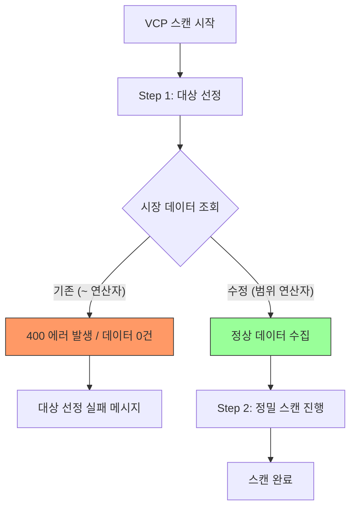

# VCP 스캔 '대상 선정 실패' 에러 해결 보고서

VCP 스캔 과정 중 Step 1에서 발생하던 "대상 선정 실패" 에러를 분석하고 해결한 내역을 정리한 문서입니다.

## 1. 에러 현상과 원인

### 현상
VCP 스캔을 실행하면 "전체 종목 리스트 수집 중..." 단계에서 약 40~50초간 멈춰 있다가, 결국 "대상 선정 실패"라는 메시지와 함께 스캔이 중단되는 현상이 발생했습니다.

### 원인 (기술적 분석)
문제의 핵심은 데이터베이스(PocketBase)에 보낸 질문지(쿼리)의 문법 오류였습니다.

1. **연산자 호환성 문제**: 
   - 현재 시스템은 주가 데이터를 PocketBase의 `Date` 타입 필드에 저장하고 있습니다.
   - 기존 코드에서는 `date ~ "2026-03-19"`와 같이 "날짜에 이 글자가 포함되어 있니?"라는 식으로 물어보았습니다 (`~` 연산자).
   - 하지만 PocketBase의 날짜 전용 필드는 이 연산자를 지원하지 않아 400(Bad Request) 에러를 발생시켰고, 결과적으로 데이터를 하나도 가져오지 못하게 된 것입니다.

2. **데이터 부재로 인한 중단**:
   - 시장 데이터 조회가 실패하여 `end_prices`나 `start_prices` 값이 비게 되었고, 시스템은 비교할 대상이 없다고 판단하여 스캔을 종료했습니다.

## 2. 해결 방법

### 쿼리 방식 변경 (범위 조회)
"글자 포함" 방식 대신 "시간 범위" 방식으로 질문을 수정했습니다.

- **기존**: `2026-03-19`라는 글자가 들어간 날짜를 찾아줘. (`~` 연산자)
- **수정**: `2026-03-19 00:00:00`부터 `2026-03-19 23:59:59` 사이의 데이터를 찾아줘. (`>=`, `<=` 연산자)

이 방식은 PocketBase의 날짜 필드와 완벽하게 호환되며, 데이터베이스 성능 측면에서도 더 효율적입니다.

### 수정된 파일
- `Scripts/02_scan_vcp.py`: 대상 선정 단계에서의 데이터 조회 로직 수정
- `Scripts/08_sync_market_data.py`: 사전 데이터 동기화 체크 로직 수정

## 3. 작업 과정 시각화

## 4. 기대 효과
- 더 이상 쿼리 문법 오류로 인해 스캔이 중단되지 않습니다.
- 데이터 동기화 체크 단계가 안정화되어 스캔 전 필수 절차가 정상적으로 수행됩니다.
- 사용자에게는 "대상 선정 실패" 대신 정상적인 로딩 바와 진행 상황이 표시됩니다.
