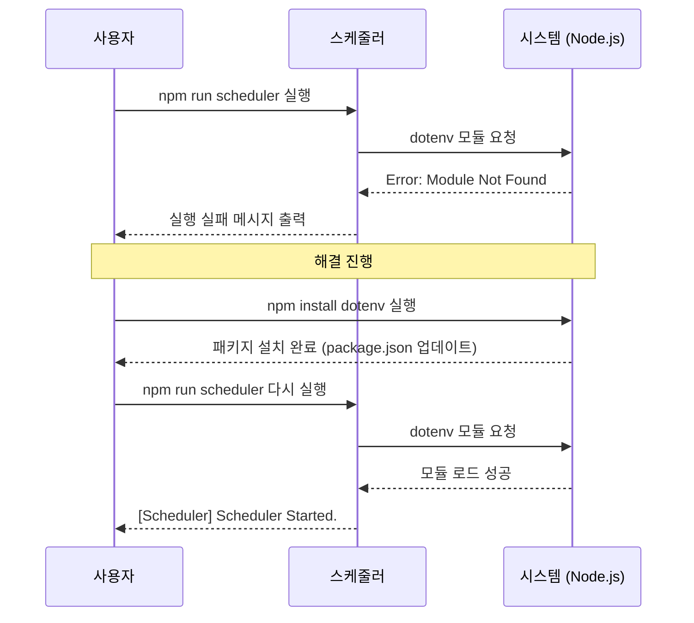

# 스케줄러 실행 에러 해결 (dotenv 모듈 미설치)

- **날짜**: 2026-03-23
- **상태**: 완료
- **태그**: #에러해결 #스케줄러 #NodeJS #dotenv

## 1. 문제 상황
`npm run scheduler` 명령어를 통해 스케줄러를 실행하려고 했으나, 다음과 같은 에러 메시지와 함께 실행이 중단되었습니다.
> Error: Cannot find module 'dotenv'

## 2. 원인 분석
스케줄러의 핵심 로직인 `backend/scriptRunner.ts` 파일에서 환경 변수를 읽어오기 위해 `dotenv` 라이브러리를 사용하고 있으나, 정작 `frontend/package.json`의 의존성(`dependencies`) 목록에는 `dotenv`가 포함되어 있지 않았습니다.

### ❓ 왜 이전에는 작동했을까요?
- 다른 패키지가 내부적으로 `dotenv`를 포함하고 있어서 운 좋게 작동했을 수 있습니다.
- 또는 패키지 설치 시 `--save` 옵션을 생략하여 `node_modules`에는 있었지만 `package.json` 기록에는 남지 않았을 수 있습니다.

## 3. 해결 방법
`frontend` 디렉토리에서 다음 명령어를 실행하여 `dotenv`를 공식적으로 설치하고 `package.json`에 기록했습니다.

```bash
npm install dotenv
```

## 4. 조치 결과
설치 후 스케줄러가 정상적으로 시작되는 것을 확인했습니다.

### ✅ 실행 확인 로그
```text
[Scheduler] Initializing Cron Jobs...
[Scheduler] Scheduler Started.
[Scheduler] Status API running on http://localhost:3001
```

### 📊 해결 과정 다이어그램


## 5. 향후 주의사항
- 새로운 라이브러리를 코드에서 사용할 때는 반드시 `npm install [패키지명]`을 통해 의존성을 관리해야 합니다.
- 프로젝트를 다른 환경으로 옮기거나 새로운 팀원이 합류할 때는 항상 `npm install`을 실행하여 모든 의존성이 설치되었는지 확인해야 합니다.
